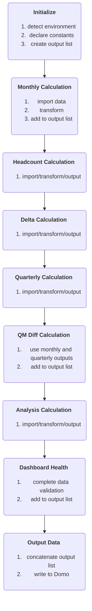

# Nomi Financial Dashboard
This project is a part of [Nomi Health](https://nomihealth.com/g).

#### -- Project Status: [Active]

## Project Intro
The purpose of this project is to clean and compile several Excel models and output a dataset powering a BI Dashboard. This repository stores the scripts for data import, transform, and export. The project is designed to run modularly in VSCode and then compile into a single text file for injection into Domo, using the "compile_scripts.py" helper tool.

### Methods Used
* Data Science Techniques (group by, pivot, melt, etc.)
* Key Creation and Mapping (joining)
* Data Visualization
* GitHub CoPilot and ChatGPT for code improvement

### Technologies
* Python (libraries listed below)
  * Pandas
  * Numpy
  * Logging
* Domo BI Tool

## Project Description
Data is provided by the Nomi Financial team and sent straight to Domo via Domo's automated 'upload via email' connector. This codebase replaces a time and labor intensive process created by a consulting team and maintained in Excel models. The data consists of Projected and Actual spend (Monthly and Quarterly spend files are supplied separately), allocation files for each Expense Bucket, and a name map for cross-referencing between the actuals and projections. The specific visualizations required necessitate several different operations (see below).

## Process
At the highest level, the process is as follows:

### Initialize
The script runs in both VSCode and Domo. The [detect_environment](https://github.com/michaperki/Nomi-Financial-Dashboard/blob/main/scripts/detect_environment.py) function uses the ```os``` library to detect whether it is being run locally or in Domo. It returns a constant ```RUNNING_IN_DOMO```.
All constants and the empty output list are declared in [constants](https://github.com/michaperki/Nomi-Financial-Dashboard/blob/main/scripts/constants.py).

### Monthly Calculation
The monthly calculation is the main transform of this ETL. It involves reformatting and cleaning the data, joining the allocations, and merging the Actuals and Projections.
The [main script](https://github.com/michaperki/Nomi-Financial-Dashboard/blob/main/scripts/_main_.py) runs the monthly calculations. First, the main script retrieves the data using [get_data](https://github.com/michaperki/Nomi-Financial-Dashboard/blob/main/scripts/get_data.py). Each file has a dictionary with the relevant file path in Domo and locally. The get_data function is written to use this dictionary (and the ) to retrieve the data from either. 

## Needs of this project

- data scientist(s) with intermediate Python
- data processing/cleaning
- code clean up
- increased data validation
- analysis view
- writeup/reporting

## Getting Started

1. Clone this repo (for help see this [tutorial](https://help.github.com/articles/cloning-a-repository/)).
2. Raw Data can be provided by the Nomi Financial team to authorized parties.    
3. Data processing/transformation scripts are being kept [here](https://github.com/michaperki/Nomi-Financial-Dashboard/tree/main/scripts)

#  sections pending below
5. Follow setup [instructions](Link to file)

## Featured Notebooks/Analysis/Deliverables
* [Notebook/Markdown/Slide Deck Title](link)
* [Notebook/Markdown/Slide DeckTitle](link)
* [Blog Post](link)


## Contributing DSWG Members

**Team Leads (Contacts) : [Michael Perkins](https://github.com/michaperki)(@mperkins1995)**

#### Other Members:

|Name     |  Slack Handle   | 
|---------|-----------------|
|[Full Name](https://github.com/[github handle])| @johnDoe        |
|[Full Name](https://github.com/[github handle]) |     @janeDoe    |

## Contact
* If you haven't joined the SF Brigade Slack, [you can do that here](http://c4sf.me/slack).  
* Our slack channel is `#datasci-projectname`
* Feel free to contact team leads with any questions or if you are interested in contributing!
