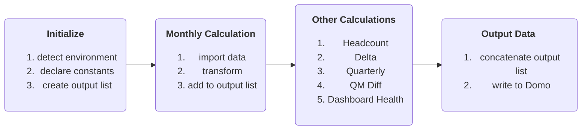

# Nomi Financial Dashboard
This project is a part of [Nomi Health](https://nomihealth.com/g).

#### -- Project Status: [Active]

# Table of Contents
- [Project Intro](#project-intro)
- [Project Description](#project-description)
- [Process](#process)
- [Needs of this Project](#needs-of-this-project)


## Project Intro
[(Back to top)](#table-of-contents)
The purpose of this project is to clean and compile several Excel models and output a dataset powering a BI Dashboard. This repository stores the scripts for data import, transform, and export. The project is designed to run modularly in VSCode and then compile into a single text file for injection into Domo, using the "compile_scripts.py" helper tool.

### Methods Used
* Data Science Techniques (group by, pivot, melt, etc.)
* Key Creation and Mapping (joining)
* Data Visualization
* GitHub CoPilot and ChatGPT for code improvement

### Technologies
* Python (libraries listed below)
  * Pandas
  * Numpy
  * Logging
* Domo BI Tool

## Project Description
[(Back to top)](#table-of-contents)
Data is provided by the Nomi Financial team and sent straight to Domo via Domo's automated 'upload via email' connector. This codebase replaces a time and labor intensive process created by a consulting team and maintained in Excel models. The data consists of Projected and Actual spend (Monthly and Quarterly spend files are supplied separately), allocation files for each Expense Bucket, and a name map for cross-referencing between the actuals and projections. The specific visualizations required necessitate several different operations (see below).

## Process
[(Back to top)](#table-of-contents)
At the highest level, the process is as follows:

### Initialize
The script runs in both VSCode and Domo. The [detect_environment](https://github.com/michaperki/Nomi-Financial-Dashboard/blob/main/scripts/detect_environment.py) function uses the ```os``` library to detect whether it is being run locally or in Domo. It returns a boolean constant ```RUNNING_IN_DOMO```.
All constants and the empty output list are declared in [constants](https://github.com/michaperki/Nomi-Financial-Dashboard/blob/main/scripts/constants.py).

### Monthly Calculation
The monthly calculation is the main transform of this ETL. It involves reformatting and cleaning the data, joining the allocations, and merging the Actuals and Projections.
The [main script](https://github.com/michaperki/Nomi-Financial-Dashboard/blob/main/scripts/_main_.py) runs the monthly calculations. 

#### Data Import
First, the main script retrieves the data using [get_data](https://github.com/michaperki/Nomi-Financial-Dashboard/blob/main/scripts/get_data.py). Each file has a dictionary declared in [constants](https://github.com/michaperki/Nomi-Financial-Dashboard/blob/main/scripts/constants.py) with the relevant file path in Domo and locally. The get_data function accepts this dictionary (and the ```RUNNING_IN_DOMO``` boolean) to retrieve the data in either environment.

##### Actual File Date
The ```ACTUAL_FILE_DATE``` is an integer representing the month of Actuals data available. Per the [Upload Checklist](https://nomihealth.atlassian.net/wiki/spaces/~6268326934b9b700687acfc6/pages/1906639311/Upload+Checklist), the Actuals must include a month name in the file (three-letter abbreviation also accepted). This month is extracted as an integer using [get_actuals_date](https://github.com/michaperki/Nomi-Financial-Dashboard/blob/main/scripts/get_actuals_date.py) and the ```ACTUAL_FILE_DATE``` stores that value.

**_NOTE:_**  During the first few months of the year, there is no Actuals data available. During this time, the boolean ```FIRST_RUN_OF_YEAR``` should be switched to ```True```. This will set ```ACTUAL_FILE_DATE``` to zero and allow the script to run. The ```DELTA_CONTROLLER``` should also be switched off at this time.

#### Data Validation
Before cleaning the data, we take stock of our input numbers to compare with our final output using [setup_data_validation](https://github.com/michaperki/Nomi-Financial-Dashboard/blob/main/scripts/setup_data_validation.py)

#### Data Cleaning
Next, the main script cleans the allocations using [clean_allocation_sheet](https://github.com/michaperki/Nomi-Financial-Dashboard/blob/main/scripts/clean_allocation_sheet.py) and the Actuals using [clean_actuals](https://github.com/michaperki/Nomi-Financial-Dashboard/blob/main/scripts/clean_actuals.py). 
Each projections model has its own cleaning function ([clean_fte](https://github.com/michaperki/Nomi-Financial-Dashboard/blob/main/scripts/clean_fte.py), [clean_orm](https://github.com/michaperki/Nomi-Financial-Dashboard/blob/main/scripts/clean_orm.py), [clean_ftc](https://github.com/michaperki/Nomi-Financial-Dashboard/blob/main/scripts/clean_ftc.py), etc).

#### Join Allocations to the Projections and Actuals
Concatenate the cleaned allocations into a single dataframe.
Then use (join_allocation_to_df)[https://github.com/michaperki/Nomi-Financial-Dashboard/blob/main/scripts/join_allocation_to_df.py] to add the allocations to the Actuals and Projections.

#### Final Formatting
Concatenate the Projections and Actuals and feed the final dataframe to [format_final_df](https://github.com/michaperki/Nomi-Financial-Dashboard/blob/main/scripts/format_final_df.py).

#### Complete the Validation
Confirm that the allocated numbers match the numbers we stored earlier in our validation setup using [validation_complete](https://github.com/michaperki/Nomi-Financial-Dashboard/blob/main/scripts/validation_complete.py).

### Headcount Calculation
Import the data fresh and use [calculate_headcount](https://github.com/michaperki/Nomi-Financial-Dashboard/blob/main/scripts/hc_calculate_headcount.py) to obtain the headcount calculations.

## Needs of this project

- data scientist(s) with intermediate Python
- data processing/cleaning
- code clean up
- increased data validation
- analysis view
- writeup/reporting

## Getting Started

1. Clone this repo (for help see this [tutorial](https://help.github.com/articles/cloning-a-repository/)).
2. Raw Data can be provided by the Nomi Financial team to authorized parties.    
3. Data processing/transformation scripts are being kept [here](https://github.com/michaperki/Nomi-Financial-Dashboard/tree/main/scripts)

#  sections pending below
5. Follow setup [instructions](Link to file)

## Featured Notebooks/Analysis/Deliverables
* [Notebook/Markdown/Slide Deck Title](link)
* [Notebook/Markdown/Slide DeckTitle](link)
* [Blog Post](link)


## Contributing DSWG Members

**Team Leads (Contacts) : [Michael Perkins](https://github.com/michaperki)(@mperkins1995)**

#### Other Members:

|Name     |  Slack Handle   | 
|---------|-----------------|
|[Full Name](https://github.com/[github handle])| @johnDoe        |
|[Full Name](https://github.com/[github handle]) |     @janeDoe    |

## Contact
* If you haven't joined the SF Brigade Slack, [you can do that here](http://c4sf.me/slack).  
* Our slack channel is `#datasci-projectname`
* Feel free to contact team leads with any questions or if you are interested in contributing!
