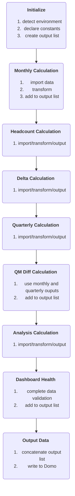

# Nomi Financial Dashboard

## Introduction
This repository stores the scripts for compiling Nomi Health financials. The script is run in the Business Intelligence tool Domo using their Magic ETL interface. 
The data output powers a BI dashboard in Domo.

compile_scripts.py gathers the needed libraries, constants, and functions and concatenates them into a single script for injection into Domo. 
The output script is saved in the compiled_scripts folder.

## Process
At ahe highest level, the process is as follows:

